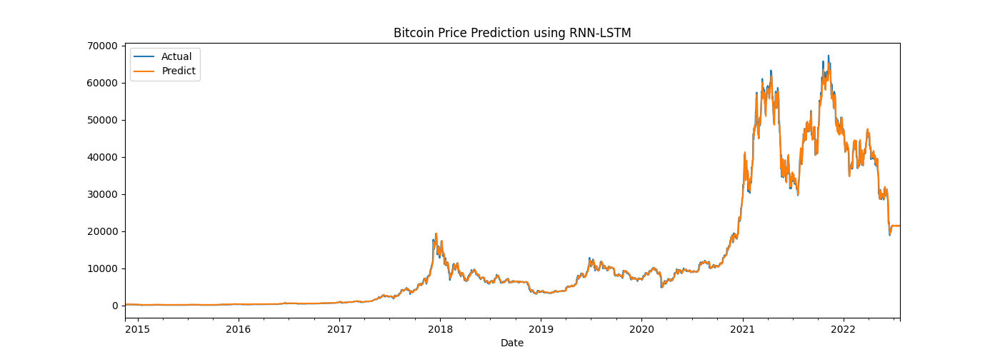

# CryptocurrenciesPricePrediction
A Neural Network LSTM model that predicts price of cryptocurrencies.

## Setup Environment

> To create a python virtual environment.
> 
> `python -m venv venv` or `python3 -m venv venv`

> Activate your virtual env.
> 
>  `.\venv\Scripts\activate` 

> Installing requirements .
> 
> `pip install -r ./requirements.txt` 

> Starting train the model.
> 
> `python ./main.py` 

## Screenshots
### Settings The Trained Model

- Currenct = BTC-USD
- Epoch Size = 10
- Lookback = 60
- Forecast = 30

|                                               |
|-----------------------------------------------|
|  |
|  |
|  |