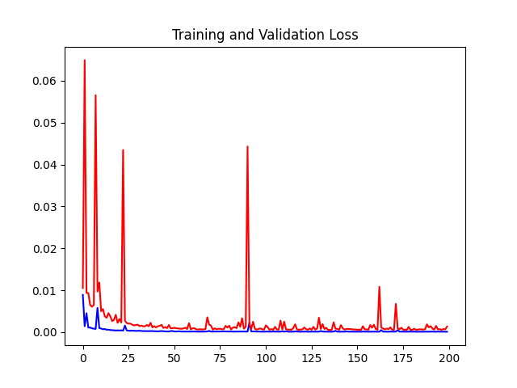

# CryptocurrenciesPricePrediction
A Neural Network LSTM model that predicts price of cryptocurrencies.

Coded by [Caner Sülüşoğlu](https://www.linkedin.com/in/caner-s%C3%BCl%C3%BC%C5%9Fo%C4%9Flu-84b5b319b/) and [Metin Cem Demirdaş](https://www.linkedin.com/in/cem-demirda%C5%9F-630b911b9/)

## Setup Environment
---------------------

> To create a python virtual environment.
> 
> `python -m venv venv` or `python3 -m venv venv`

> Activate your virtual env.
> 
>  `.\venv\Scripts\activate` 

> Installing requirements .
> 
> `pip install -r ./requirements.txt` 

> Starting train the model.
> 
> `python ./main.py` 

## Arguments Informations

---------------------

Using `-h` or `--help` keyword, informations about arguments will be shown.

### Train Arguments Table

These parameters are using with `train` keyword:

| Short    | Long                     | Default | Description |
|----------|--------------------------|---------|-------------|
| `-c`   | `--currency`               | BTC-USD | Crypto currency parity.                      |
| `-d`   | `--download_dataset`       | False   | Download current time dataset?               |
| `-udd` | `--use_downloaded_dataset` | False   | Use already downloaded dataset?              |
| `-lm`  | `--load_model`             | False   | Load trained model?                          |
| `-e`   | `--epoch`                  | 200     | Epoch number.                                |
| `-l`   | `--lookback`               | 60      | Subset count that is looking backward.       |
| `-f`   | `--forecast`               | 30      | Days count that will be predicted in future. |

Example: `python train -c 'BTC-USD' -d -udd -e 100 -l 120 -f 60`

### Test Arguments Table

These parameters are using with `test` keyword:

| Short    | Long                     | Default | Description |
|----------|--------------------------|---------|-------------|
| `-c`   | `--currency`               | BTC-USD | Crypto currency parity.                      |
| `-l`   | `--lookback`               | 60      | Subset count that is looking backward.       |
| `-f`   | `--forecast`               | 30      | Days count that will be predicted in future. |

Example: `python test -c 'BTC-USD' -l 120 -f 60`

### Pre Trained Models Screenshots

Currency = BTC-USD

Epcoh = 200

Batch Size = 50

| Lookback | Forecast  | Loss | All Time |
|----------|-----------|----------------------------------------------------------------|-------------------------------------------------------------------|
| 60       | 30        |   |   |
| 180      | 90        |  |  |
| 360      | 180       | | |
| 720      | 360       | | |